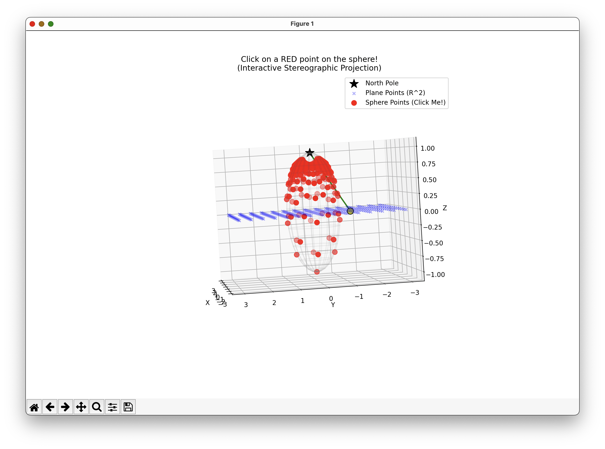

# 🌐 StereoProj-Viz: Interactive Manifold Projection

[](https://www.python.org/)
[](https://matplotlib.org/)
[](https://en.wikipedia.org/wiki/Riemannian_geometry)

> **Visualizing the bijection between Euclidean Space ($\mathbb{R}^2$) and the Riemann Sphere ($S^2$).**

This educational tool provides an interactive 3D visualization of the **Inverse Stereographic Transform**. It is designed to demonstrate how probability densities are mapped from a flat plane to a curved manifold, a core concept in **Riemannian Normalizing Flows**.



## 🎯 Motivation

In geometric deep learning, we often need to bridge the gap between Euclidean space (where standard algorithms work) and Riemannian Manifolds (where data lives).This tool visualizes the Inverse Stereographic Transform, showing how we can define a distribution on a flat plane ($\mathbb{R}^2$) and "wrap" it onto a curved sphere ($S^2$). Since the mapping is bijective, understanding this geometry is crucial for both:Generation: Mapping latent variables from plane to sphere.Inference: Projecting spherical data back to the plane for density estimation.

## ✨ Features

* **Interactive Picking:** Click on any **Red Point** (Sphere $S^2$) to visualize its connection to the **Blue Plane** ($\mathbb{R}^2$).
* **Ray Tracing:** Dynamically draws the projection line from the North Pole, through the Sphere, to the Plane.
* **Density Correction Info:** Real-time calculation of the **Jacobian Factor** (stretch factor), showing why density correction formulas (like $\sqrt{\det G}$) are necessary for probability conservation.
* **Visualizing Distortion:**
    * *South Pole (Origin):* Low distortion, ray is vertical.
    * *North Pole (Infinity):* High distortion, ray is highly oblique.

## 🧮 Mathematical Background

The tool visualizes the map $\phi: \mathbb{R}^n \to S^n$. For a point $u \in \mathbb{R}^2$, the corresponding point $x \in S^2$ is given by:

$$x = \frac{2u}{||u||^2 + 1}, \quad y = \frac{2v}{||u||^2 + 1}, \quad z = \frac{||u||^2 - 1}{||u||^2 + 1}$$

The **Jacobian Determinant** (area change) displayed in the console follows the metric:

$$\sqrt{\det G} \propto \left( \frac{2}{||u||^2 + 1} \right)^n$$

## 🚀 Getting Started

### Prerequisites

* Python 3.x
* `numpy`
* `matplotlib`

```bash
pip install numpy matplotlib
